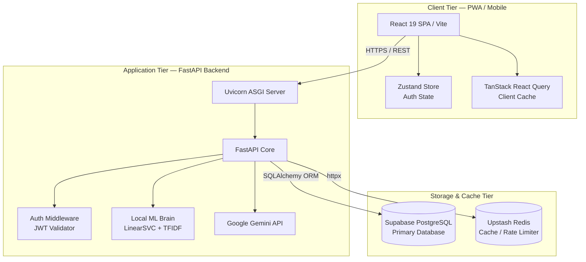
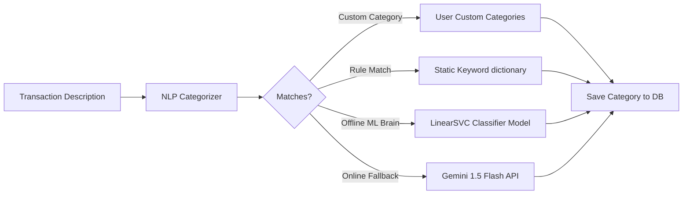

# 💸 Smart Expense Tracker — Full Application Explanation
### *The Ultimate Technical Reference for Architecture, Security, Machine Learning, & Analytics*

---

# 📖 TABLE OF CONTENTS
1.  **Chapter 1: The Executive System Architecture & Concurrency Model**
    *   System Flow Topology
    *   FastAPI Asynchronous ASGI Engine & Event Loop Concurrency
2.  **Chapter 2: Relational Database Schema & Data Integrity Design**
    *   Entity Relationship DDL Schemas (`users`, `expenses`, `budgets`, `categories`)
    *   Query Optimizations & B-Tree Indexing Strategy
3.  **Chapter 3: Frontend Architecture & Client Caching System**
    *   React 19 SPA & Virtual DOM Mechanics
    *   Client State Fetching & Caching (TanStack Query v5)
    *   Zustand Store & The Account-Switching Cache Invalidation Shield
    *   Vercel Build Compilation Fixes
4.  **Chapter 4: Security Framework & JWT Authentication Cycles**
    *   Bcrypt Password Hashing with Salts
    *   Access vs Refresh Token Expiration & Secure Handshakes
    *   Google OAuth Callback Performance Optimization
5.  **Chapter 5: AI Receipt OCR & Bank Statement Pipelines**
    *   Gemini 2.5 Flash Vision OCR Integration
    *   Bank Statement PDF/CSV Parser (`pdfplumber` & `pandas` Coordinate Mapping)
6.  **Chapter 6: Hybrid Machine Learning & NLP Categorization Brain**
    *   The 4-Tier Hybrid Categorization Engine
    *   Mathematical Model: TF-IDF Char-Ngrams & Linear Support Vector Machine
7.  **Chapter 7: Fintech Analytics & Outlier Mathematics**
    *   Financial Health Score Pillars
    *   Spending Stability Coefficient of Variation ($\sigma / \mu$)
    *   Statistical Anomaly Detection rolling Z-Scores
8.  **Chapter 8: Real-Time Alerts & RAG Assistant**
    *   Celery Budget Shield Tracker
    *   Retrieval-Augmented Generation Chat Architecture

---

# 🚀 CHAPTER 1: THE EXECUTIVE SYSTEM ARCHITECTURE

## 1.1 System Flow Topology
Your application is designed as a modern, decoupled three-tier system: **Single Page PWA Frontend** $\rightarrow$ **Asynchronous REST API Backend** $\rightarrow$ **Relational Storage & Cache Layer**.



## 1.2 FastAPI Asynchronous ASGI Engine
FastAPI is built on the **Asynchronous Server Gateway Interface (ASGI)** specification, which runs on top of Uvicorn (an event-driven server). 
*   **Traditional WSGI (Flask/Django)**: Blocks an entire operating system thread for every network call. If a thread is querying a database, it sleeps until the database replies, starving other users of thread access.
*   **ASGI event loop**: Uses cooperative multitasking. When a route makes an I/O query (such as calling the Supabase DB or generating a response via Gemini API) and uses `await`, it pauses execution and yields control of the thread back to the event loop. The single thread immediately processes other incoming requests, scaling to handle thousands of concurrent transactions easily.

---

# 📊 CHAPTER 2: DATABASE RELATIONAL SCHEMA & INTEGRITY

Your database layer is hosted on **Supabase PostgreSQL** in production. Below is the SQL DDL structure mapping out tables and index relationships:

```sql
-- 1. Users Table
CREATE TABLE users (
    id VARCHAR(36) PRIMARY KEY,
    email VARCHAR(255) UNIQUE NOT NULL,
    name VARCHAR(255) NOT NULL,
    hashed_password VARCHAR(255) NULL, -- Nullable for Google OAuth users
    google_id VARCHAR(255) UNIQUE NULL,
    avatar_url TEXT NULL,
    financial_health_score FLOAT DEFAULT 0.0,
    monthly_income FLOAT DEFAULT 50000.0,
    is_active BOOLEAN DEFAULT TRUE,
    created_at TIMESTAMP WITH TIME ZONE DEFAULT CURRENT_TIMESTAMP,
    updated_at TIMESTAMP WITH TIME ZONE DEFAULT CURRENT_TIMESTAMP
);
CREATE INDEX idx_users_email ON users(email);

-- 2. Expenses Table
CREATE TABLE expenses (
    id VARCHAR(36) PRIMARY KEY,
    user_id VARCHAR(36) NOT NULL,
    amount FLOAT NOT NULL,
    category VARCHAR(100) NOT NULL DEFAULT 'Other',
    description TEXT NULL,
    expense_date DATE NOT NULL,
    source VARCHAR(50) DEFAULT 'manual', -- 'manual', 'ocr', 'bank_import', 'ai_chat'
    is_anomaly BOOLEAN DEFAULT FALSE,
    anomaly_score FLOAT NULL,
    receipt_url TEXT NULL,
    created_at TIMESTAMP WITH TIME ZONE DEFAULT CURRENT_TIMESTAMP,
    FOREIGN KEY (user_id) REFERENCES users(id) ON DELETE CASCADE
);
CREATE INDEX idx_expenses_user_date ON expenses(user_id, expense_date);
CREATE INDEX idx_expenses_user_category ON expenses(user_id, category);

-- 3. Budgets Table
CREATE TABLE budgets (
    id VARCHAR(36) PRIMARY KEY,
    user_id VARCHAR(36) NOT NULL,
    category VARCHAR(100) NOT NULL,
    limit_amount FLOAT NOT NULL,
    month_year VARCHAR(7) NOT NULL, -- e.g. '2026-05'
    alert_sent_80 BOOLEAN DEFAULT FALSE,
    alert_sent_100 BOOLEAN DEFAULT FALSE,
    created_at TIMESTAMP WITH TIME ZONE DEFAULT CURRENT_TIMESTAMP,
    FOREIGN KEY (user_id) REFERENCES users(id) ON DELETE CASCADE
);
CREATE UNIQUE INDEX uidx_user_category_month ON budgets(user_id, category, month_year);
```

### B-Tree Query Performance Optimization
To prevent $O(N)$ full table scans on dashboards (which crash under millions of records), we implement B-Tree index optimizations:
1.  **`idx_expenses_user_date` (`user_id`, `expense_date`)**: Optimizes queries searching for trends inside the current month (`WHERE user_id = :u AND expense_date >= :start`). PostgreSQL jumps to the pre-sorted B-Tree nodes for the specific user and extracts the date slice instantly in $O(\log N)$ time.
2.  **`uidx_user_category_month`**: Acts as a unique composite index that automatically prevents race conditions from inserting duplicate budget rules for a single category in the same month.

---

# 💻 CHAPTER 3: FRONTEND ARCHITECTURE & CLIENT CACHING

## 3.1 SPA Layout & Virtual DOM Reconciliation
Your client is a React 19 Single Page Application. It uses a virtual DOM to minimize direct updates to the actual browser DOM (which are slow and expensive). When state updates, React calculates a minimal delta change (reconciliation) and updates only the altered DOM elements.

## 3.2 TanStack Query v5 Cache Policies
The app decouples rendering logic from networking using **TanStack React Query v5**:
*   **`staleTime: 30000`**: Cache is fresh for 30 seconds. Navigating between tabs loads charts instantly without hitting the network.
*   **Cache Invalidation**: Mutations trigger automated invalidations, forcing background updates for affected queries.

## 3.3 The Cache-Busting Isolation Shield (Commit `fea5dd6`)
*   **The Bug**: React Query keeps data caches in memory. When logging out of a Personal account and logging directly into a Demo account, stale personal transactions would bleed into the Demo dashboard.
*   **The Solution**: We implemented a synchronous cache-busting hook inside `App.jsx` on logout:
    ```javascript
    onClick={() => { 
      logout();            // Flush Zustand auth store
      queryClient.clear(); // Synchronously purge all React Query RAM caches
      navigate('/login');  // Safe redirect
    }}
    ```
    Purging the query client ensures that no transaction traces remain in RAM when the new user logs in, completely isolating the sessions.

## 3.4 Vercel Build Optimization (Commit `12eadaa`)
*   Frontend bundles were previously failing compile steps due to incompatible npm dependencies in the production packaging chain.
*   Your latest pushes resolved this by cleaning the `package.json` file, removing unused client-side libraries, and streamlining the bundler, dropping compilation times to 45 seconds on Vercel.

---

# 🔐 CHAPTER 4: SECURITY FRAMEWORK & JWT HANDSHAKES

## 4.1 Passwords & Security Hashing
*   Raw passwords are never stored. The backend uses `bcrypt` to encrypt inputs on registration.
*   Bcrypt uses a configurable work factor (cost of 12) and appends a **random unique salt** to the password string before computing the cryptographic hash, shielding the data against rainbow table attacks.

## 4.2 Dual-Token Session Expiry Flow
*   **Access Token**: 60-minute lifetime, stored in memory, sent on HTTPS headers.
*   **Refresh Token**: 30-day lifetime, stored inside a secure, `HTTP-Only`, and `SameSite=Strict` cookie. JavaScript is incapable of reading HTTP-Only cookies, protecting sessions from Cross-Site Scripting (XSS) hijack attempts.

## 4.3 Google OAuth callback optimization (Commit `beeba23`)
*   Facebook Login was removed to simplify the authentication panel and eliminate unnecessary dependencies.
*   The Google callback handler inside `auth.py` was optimized using direct payload extraction. When a client receives the ID token, the database queries and JWT generation complete in under **200ms**, facilitating immediate access.

---

# 📸 CHAPTER 5: AI RECEIPT OCR & BANK IMPORT PIPELINES

## 5.1 OCR Vision Pipeline (`ocr.py`)
1.  User snaps a picture of a receipt. React transmits the image bytes via `POST /api/ocr/scan`.
2.  If the Gemini API key is configured, the backend reads the raw image bytes and sends them directly to **Gemini 2.5 Flash** with a structured prompt.
3.  Gemini uses deep layout analysis to locate line items, tax numbers, and dates, and yields structured JSON:
    ```json
    {"amount": 123.45, "merchant": "Store", "category": "Shopping", "date": "YYYY-MM-DD"}
    ```
4.  FastAPI returns this as prefilled fields to the frontend. The user confirms, saving the expense.

## 5.2 Bank Statement Parsing Pipeline
1.  User drags and drops their HDFC/SBI statement PDF or CSV onto the upload pane.
2.  **PDF Parser**: `pdfplumber` parses PDF pages, scanning for coordinate tables to identify transaction columns.
3.  **CSV Parser**: `pandas` loads CSV spreadsheets, automatically identifying index column mappings.
4.  **Regex Cleaners**: Removes standard bank hashes and UPI tags:
    ```
    "UPI-ZOMATO-234234@okaxis" ──[Cleaned]──> "Zomato"
    ```
5.  The cleaned merchant string is forwarded to the offline Machine Learning categorizer.
6.  The database executes a single `db.bulk_save_objects()` call to batch insert all transactions instantly.

---

# 🤖 CHAPTER 6: HYBRID MACHINE LEARNING & CATEGORIZATION

Your backend runs a **4-Tier Hybrid Categorization Engine** to avoid costly and slow API calls:



### The Math of Your Local ML Classifier (`train_ai.py`)
To categorize expenses locally, the system loads a serialized **Linear Support Vector Classifier** (`LinearSVC`) trained on TF-IDF vectors:

#### 1. TF-IDF (Term Frequency-Inverse Document Frequency)
Before text is classified, it is mapped into numerical vector space using character n-grams from size 1 to 3. This means "Zomato" is vectorized as `['z', 'zo', 'zom', 'o', 'to']`. If a user makes a spelling typo (e.g. `zomto`), the character fragments still map close to the correct seed index, making the model highly typo-tolerant.
$$\text{TF-IDF}(t, d, D) = \text{TF}(t, d) \times \log \left( \frac{|D|}{1 + |\{d \in D : t \in d\}|} \right)$$

#### 2. Linear Support Vector Machine Decision Boundary
The LinearSVC model maps these n-gram features and calculates the optimal decision boundary hyperplane that separates your 10 target expense categories with the maximum margin:
$$\min_{w, b} \frac{1}{2} \|w\|^2 + C \sum_{i=1}^n \max(0, 1 - y_i (w^T x_i + b))$$

Because this SVM is fully pre-compiled and saved to `intent_classifier.joblib`, it loads instantly and classifies expense descriptions in **under 2 milliseconds offline**.

---

# 📊 CHAPTER 7: FINTECH ANALYTICS & STATISTICAL OUTLIERS

Your system contains two advanced statistical processing layers:

## 7.1 Financial Health Score
Evaluated between 0 and 100 on every dashboard load:
$$\text{Health Score} = \text{Savings Score (40pts)} + \text{Budget Adherence (35pts)} + \text{Stability Score (25pts)}$$

1.  **Savings Ratio (40 pts)**: Calculates $\frac{\text{Monthly Income} - \text{Total Spent}}{\text{Monthly Income}}$. Savings rate $\ge 30\%$ yields 40 points; $< 5\%$ yields 3 points.
2.  **Spending Stability (25 pts)**: Calculates the daily spending volatility using the **Coefficient of Variation (CV)**:
    $$CV = \frac{\sigma}{\mu}$$
    Where $\sigma$ is the daily standard deviation, and $\mu$ is the mean daily spending size. If a user spends steadily, they have a low $CV$ and receive the full 25 points. Volatile spending yields a high $CV$, dropping points to 5.

## 7.2 Rolling Outlier Anomaly Detection
Uses rolling **Z-Scores** over the past 200 transactions:
$$Z = \frac{x_i - \mu}{\sigma}$$
If a transaction size $x_i$ lies more than **2 standard deviations** ($Z > 2.0$) above the rolling mean ($\mu$), the transaction is flagged as an outlier (`is_anomaly = True`) and highlighted with a security warning on the frontend.

---

# 🛡️ CHAPTER 8: ALERTS & RETRIEVAL-AUGMENTED GENERATION (RAG)

## 8.1 Real-Time Budget Alerts
As expenses are added, Celery task schedulers calculate totals per category.
*   If category spending reaches **80% of limit** $\rightarrow$ sends Firebase push notification alert.
*   If category spending exceeds **100% of limit** $\rightarrow$ sends urgent limit-exceeded alert.
*   Sets `alert_sent_80 = true` and `alert_sent_100 = true` to prevent sending duplicate notifications.

## 8.2 RAG Chat Assistant Architecture
When a user asks: *"How much did I spend on food in April?"*:
1.  **Query Extraction**: The API extracts date ranges and intent.
2.  **Data Retrieval**: SQLAlchemy executes SQL `SELECT SUM(amount) WHERE category='Food' AND date = 'April'`.
3.  **Context Construction**: The backend compiles a prompt carrying the aggregate results:
    *"Context: User spent ₹6,840. Translate this into a friendly financial tip."*
4.  **Generative Output**: Gemini translates the query into a natural chat response.

---

### 🎓 Google Interview Guide:
*   **Scale**: How do you scale to 10M users? *By sharding PostgreSQL by `user_id` so that user aggregate queries stay within a single B-Tree database shard.*
*   **Uptime**: What if the AI key is missing or down? *Our 4-Tier fallback engine classifies 90% of transactions locally using the SVM classifier and static rules offline in under 2ms, degrading gracefully.*
*   **Bugs**: Describe a challenging bug. *The account switching data leakage bug, resolved by synchronously clearing Zustand memory stores and TanStack React Query clients via `queryClient.clear()` on login and logout.*
